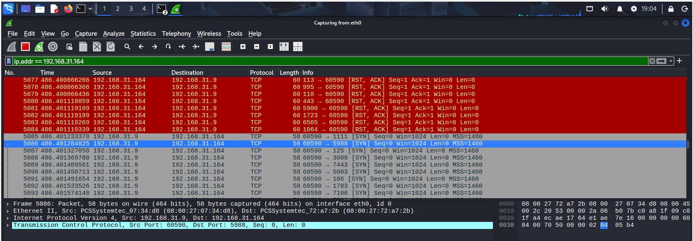
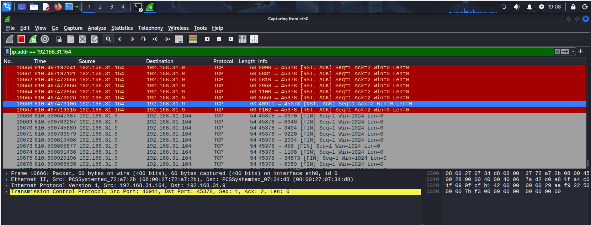
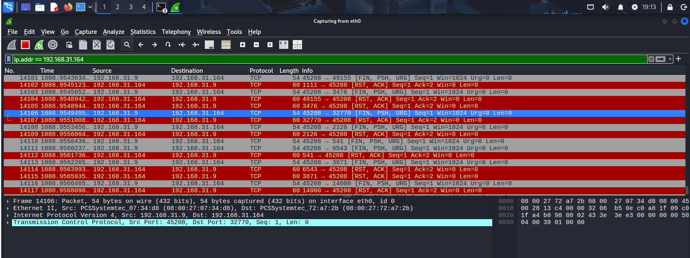
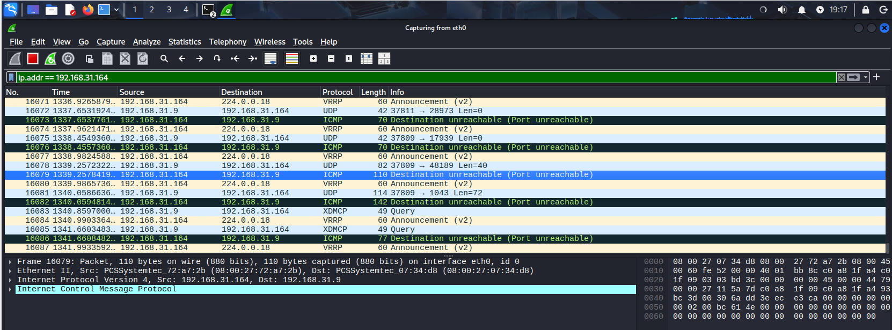

# Домашнее задание к занятию «Уязвимости и атаки на информационные системы» - Петр Петров
### Задание 1.
Скачайте и установите виртуальную машину Metasploitable: https://sourceforge.net/projects/metasploitable/.  
Это типовая ОС для экспериментов в области информационной безопасности, с которой следует начать при анализе уязвимостей.  
Просканируйте эту виртуальную машину, используя nmap.  
Попробуйте найти уязвимости, которым подвержена эта виртуальная машина.  
Сами уязвимости можно поискать на сайте https://www.exploit-db.com/.  
Для этого нужно в поиске ввести название сетевой службы, обнаруженной на атакуемой машине, и выбрать подходящие по версии уязвимости.  
Ответьте на следующие вопросы:  
Какие сетевые службы в ней разрешены?  
Какие уязвимости были вами обнаружены? (список со ссылками: достаточно трёх уязвимостей)  
Приведите ответ в свободной форме.  

### Решение 1.
**Какие сетевые службы в ней разрешены?**  
**Ответ:** В результате сканирования были обнаружены следующие открытые порты и сетевые службы:  
1. 21/tcp - FTP (vsftpd 2.3.4)  
2. 22/tcp - SSH (OpenSSH 4.7p1)  
3. 23/tcp - Telnet (Linux telnetd)  
4. 25/tcp - SMTP (Postfix smtpd)  
5. 53/tcp - DNS (ISC BIND 9.4.2)  
6. 80/tcp - HTTP (Apache httpd 2.2.8)  
7. 111/tcp - RPCBind (2)  
8. 139/tcp - Samba (smbd 3.X - 4.X)  
9. 445/tcp - Samba (smbd 3.0.20-Debian)  
10. 3306/tcp - MySQL (MySQL 5.0.51a-3ubuntu5)  
11. 5432/tcp - PostgreSQL (PostgreSQL DB 8.3.0 - 8.3.7)  
12. 5900/tcp - VNC (протокол 3.3)  
13. 6667/tcp - IRC (UnrealIRCd)  
14. 8009/tcp - AJP13 (Apache Jserv)  
15. 8180/tcp - HTTP (Apache Tomcat/Coyote JSP engine 1.1)  
 
**Какие уязвимости были вами обнаружены? (список со ссылками: достаточно трёх уязвимостей)**  
1. vsftpd 2.3.4  
Уязвимость, позволяющее удаленное выполнение команд. [Ссылка](https://www.exploit-db.com/exploits/49757)  

2. UnrealIRCd  
Удалённое выполнение команд (RCE) [Ссылка](https://www.exploit-db.com/exploits/16922)  
3. Samba (smbd 3.X - 4.X)  
Произвольная загрузка модулей [Ссылка](https://www.exploit-db.com/exploits/42084)  

### Задание 2.
Проведите сканирование Metasploitable в режимах SYN, FIN, Xmas, UDP.  
Запишите сеансы сканирования в Wireshark.  
Ответьте на следующие вопросы.  
Чем отличаются эти режимы сканирования с точки зрения сетевого трафика?  
Как отвечает сервер?  
Приведите ответ в свободной форме.  

### Решение 2.
**Сканирование Metasploitable в режиме SYN:**  
Отправка TCP-пакетов с установленным флагом SYN. Позволяет скрыть сканирование от некоторых систем обнаружения вторжений, так как не устанавливает полное TCP-соединение.  
Ответы :  
SYN, ACK — значит порт открыт  
RST — порт закрыт  
Трафик имитирует начало TCP-соединения, но не завершает его  
  

**Сканирование Metasploitable в режиме FIN:**  
Отправка TCP-пакетов только с флагом FIN. Может обойти некоторые системы обнаружения вторжений (IDS) и фаерволы, которые могут не реагировать на такие пакеты.  
Нет ACK и SYN пакетов. Если открытый порт - молчание. Закрытый порт - RST. Позволяет определить открытые и закрытые порты.  
  

**Сканирование Metasploitable в режиме Xmas:**  
Отправка TCP-пакетов только с флагами FIN, URG и PSH, , но не устанавливается полное TCP-соединение.  
Сервер не отвечает на пакет, что значит открытый порт. Это делает сканирование менее заметным, так как нет явных признаков активности.  
Сервер отвечает пакетом с флагом RST, значит что порт закрыт.  
  

**Сканирование Metasploitable в режиме UDP:**  
Определение открытых и закрытых UDP-портов с использованием UDP-пакетов.  
Если сервер не отвечает на UDP-пакет, что интерпретируется как открытый порт (отсутствие ответа).  
Если сервер отвечает ICMP-сообщением Destination Unreachable (Port Unreachable), то порт закрыт.  
Самый медленный и шумный тип сканирования  
  
